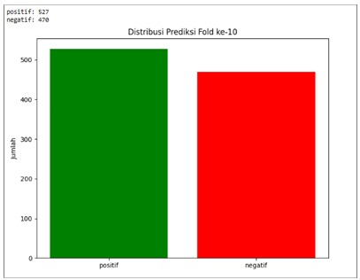

### analisis-sentimen-naive-bayes

Merupakan Projek Tugas Akhir(Skripsi) Haikal Setiawan, Projek ini menganalisis review di Google Play Store pada Aplikasi SuperApp Byond by BSI dengan menggunakan metode Naive Bayes.

### Dataset

Dataset diambil dengan mengumpulkan data pada pendekatan scraping data (lebih tepatnya web scraping API) dari Google Play Store, kemudian rating bintang yang menyertai setiap ulasan digunakan sebagai label. Strategi ini mengadopsi pendekatan *distant supervision*.

### Hasil Analisis Sentimen

Pembagian dilakukan dengan rasio 90:10, di mana 90% data digunakan untuk melatih model, sementara 10% sisanya digunakan untuk menguji performa model.

